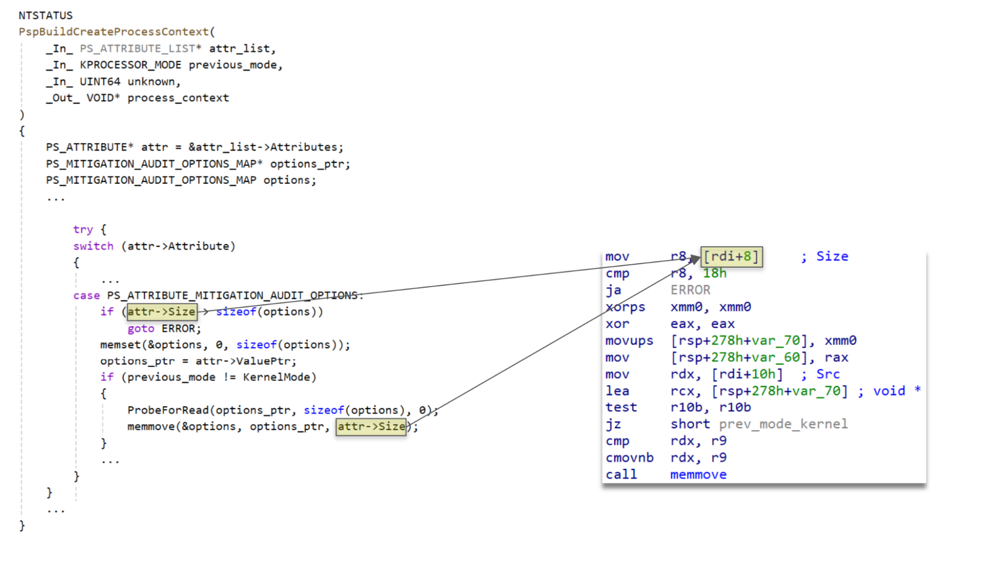
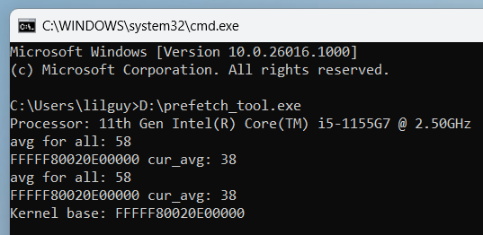
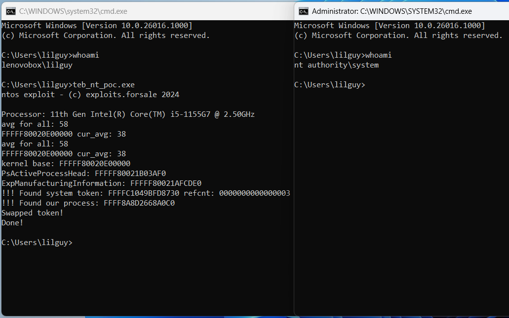

+++
title = "Exploiting the NT Kernel in 24H2: New Bugs in Old Code & Side Channels Against KASLR"
date = 2024-04-26
[extra]
author = "gabe_k"
logo = "cb.svg"
+++

Source code: [https://github.com/exploits-forsale/24h2-nt-exploit](https://github.com/exploits-forsale/24h2-nt-exploit)

## Background

The upcoming version of Windows 11, 24H2, is currently in public preview via the Windows Insider Program. This post covers the process of discovering multiple kernel vulnerabilities introduced in 24H2 and writing an exploit, including bypassing new hardening to kernel ASLR (KASLR).

All the vulnerabilities described here are in the NT kernel itself (ntoskrnl.exe), in syscalls which may be called by any process, regardless of its privilege level or sandbox.

## New Bugs in Old Code

While reverse engineering various parts of the NT kernel in 24H2 I discovered two vulnerabilities, both of which were [double-fetches of user mode memory](https://j00ru.vexillium.org/papers/2013/bochspwn.pdf) (credit: j00ru). These bugs were especially interesting because they appeared in long–present code that had previously been safe.

### Changes Regarding The Volatility of User Mode Memory

I’d like to start this section with a disclaimer: much of the following is best-guess speculation. Without access to source code and the exact compiler used it is impossible to know with complete certainty what changed on Microsoft’s side to introduce the observed changes to the binaries.

In 24H2 there appears to have been broad changes made to treat user mode memory as volatile within the kernel. One piece of evidence for this is the addition of a new memory copy function named [`RtlCopyVolatileMemory`](https://learn.microsoft.com/en-us/windows-hardware/drivers/kernel/nf-wdm-rtlcopyvolatilememory) which, as the name suggests, behaves exactly like RtlCopyMemory but explicitly for accessing volatile memory. Many instances where the kernel previously copied user mode memory into kernel mode with inlined read and store instructions have been replaced with calls to this new function. A few instances of this can be seen below:

_Case 1: a 4-byte read from user mode memory in `NtCreateTimer2`_

_Case 2: a 16-byte read from user mode memory in `ObpCaptureBoundaryDescriptor`_

This change to treating user mode memory as volatile in 24H2 can also be seen in a [public pull request on Microsoft’s GitHub](https://github.com/microsoft/xdp-for-windows/pull/188), in my view lending credibility to the theory that this was a wide-ranging change.

These changes also explain the appearance of double-fetches in areas where they may previously have been hidden by compiler optimization. A traditional double-fetch in source code, dereferencing the same location in user mode memory twice, may have been optimized into a single dereference in the resulting binary. If the memory location is treated as volatile however, every dereference in source code should correspond to a unique dereference in the binary. Below I will detail the two vulnerabilities I found that I suspect are a result of this pattern.

### CVE-2024-26218: Double-Fetch in PspBuildCreateProcessContext Leads to Stack Buffer Overflow

When creating a process, various attributes about the process being created are provided to the [`NtCreateUserProcess`](https://ntdoc.m417z.com/ntcreateuserprocess) syscall in a [`PS_ATTRIBUTE_LIST`](https://ntdoc.m417z.com/ps_attribute_list) structure. The `PS_ATTRIBUTE_LIST` is, as the name suggests, an array of [`PS_ATTRIBUTE`](https://ntdoc.m417z.com/ps_attribute) structures. The `PspBuildCreateProcessContext` function processes this list of attributes which reside in user mode memory.

`PspBuildCreateProcessContext` contains a large number of cases for handling [each type of attribute](https://ntdoc.m417z.com/ps_attribute_num). When handling attributes of types `PsAttributeMitigationOptions` and `PsAttributeMitigationAuditOptions` there is a double-fetch of the Size field in the `PS_ATTRIBUTE`. **By changing the value of Size in the time between the fetches it is possible to trigger a stack buffer overflow.**

Below I have provided pseudo-code and the corresponding disassembly from the binaries of the 23H2 version of the relevant code which does not contain a double-fetch, followed by the pseudo-code and disassembly for the vulnerable version in 24H2.

_23H2_

_24H2_

As shown above, the change to treating the attribute as volatile results in what was previously a single dereference being replaced with two separate dereferences.

### CVE-2024-21345: Double-Fetch in NtQueryInformationThread Leads to Arbitrary Write

This bug is similar to the previous one in that it is once again double-fetching a length field in code that previously only contained a single fetch. In contrast to the previous bug this bug does not lead to a buffer overflow, but rather to the bypass of the probe of a user provided address. Bypassing a probe allows a user to specify a completely arbitrary address, including a kernel address, to be written to.

`NtQueryInformationThread`, like other `NtQueryInformation`* syscalls, contains a gigantic switch statement for handling different information classes that can be passed in to query information about kernel objects from user mode. This specific bug is in the handling of the `ThreadTebInformation` information class, which allows reading of parts of the thread’s [TEB](https://learn.microsoft.com/en-us/windows/win32/api/winternl/ns-winternl-teb). The input for this specific case is a [`THREAD_TEB_INFORMATION`](https://ntdoc.m417z.com/thread_teb_information) structure residing in user mode memory. This struct contains a destination pointer for where to store the TEB data, as well as a size specifying how much data to read from the TEB.

The code for this bug is less straightforward than the previous one. In this bug the user supplied struct is copied entirely into kernel mode, however, when performing a call to `ProbeForWrite`, the struct in user mode memory is dereferenced again to pass the size. For all uses of the user input after the call to `ProbeForWrite` the kernel copy of the structure is used. `ProbeForWrite` contains a little-known quirk: if a size of zero is passed the function will return immediately without checking the passed address. **This means that if a kernel address is passed to `ProbeForWrite` with a size of zero, no exception will be raised, thereby essentially bypassing the probe.**

As in the previous case I have provided my pseudo-code representing how the source code may look, alongside with the assembly from the binary, for both the 23H2 binary which does not include the vulnerable as well as the vulnerable code in 24H2.

_23H2_

_24H2_

As the code above shows, by having `BytesToRead` in user mode be a non-zero value at the time of the first dereference, and then changing it to zero before the second dereference, the code will pass a size of zero to `ProbeForWrite`, bypassing the check of the actual address and allowing a kernel address to be specified. Later, when `memmove` is called, the size will be the original value of `BytesToRead` from the first dereference. This allows a copy of the contents of the TEB to be performed to a controlled address with a controlled size.

Because the TEB resides in user mode memory, the contents of it are also controllable. By writing to the TEB and then triggering this vulnerability to read from the TEB it is possible to write entirely controlled data anywhere in kernel mode memory.

## KASLR in 24H2

In previous Windows versions defeating KASLR has been trivial due to a number of syscalls including kernel pointers in their output. In 24H2 however, as documented by Yarden Shafir in a [blog post analyzing the change](https://windows-internals.com/kaslr-leaks-restriction/), these kernel address leaks are no longer available to unprivileged callers.

In the absence of the classic KASLR bypasses, in order to determine the layout of the kernel a new technique is needed. I had heard of one technique used on Linux called [EntryBleed](https://www.willsroot.io/2022/12/entrybleed.html), which used a timing side-channel to determine the address of the kernel, and decided to investigate if something similar could be used on Windows.

### EntryBleed & Intro to Prefetch

A very brief summary of EntryBleed is as follows: KPTI (Kernel Page Table Isolation) was a feature introduced in Linux to mitigate Spectre style attacks by separating the user and kernel page tables by removing all kernel memory from user mode page tables. One flaw in this, however, is that when a user mode application performs a syscall the memory containing the syscall handler code must be present in the page tables. This meant that a small region of kernel memory, the syscall handler, was still present in the user mode page tables.

Since the syscall handler’s memory is present in the user mode page tables, one could locate the memory’s address if it is possible to determine if a given address is present in the page tables or not. This is where the prefetch instruction comes in. Prefetch takes an address and attempts to load the content of it into the CPU’s cache so that future accesses will be faster. Unlike instructions that read or write to a given address, prefetch does not care if the address provided is a kernel address. It turns out that by measuring the amount of time a prefetch instruction takes to execute given a target address, it is possible to determine if the target address is in the current page tables.

This is, as stated above, a very short summary of EntryBleed. For a much more detailed description I highly recommend [reading the original article](https://www.willsroot.io/2022/12/entrybleed.html).

### Prefetch on Windows

After getting an understanding of EntryBleed on Linux, I started porting the technique to Windows. I initially assumed that I would have to contend with KVA shadowing (the Windows equivalent of KPTI) but soon realized that KVA shadowing is now disabled on modern Windows 11 machines. This means that since there is no longer any isolation between user and kernel page tables, not only is the memory for the syscall handler present in user mode page tables, but the entire kernel address space is present.

Additionally I discovered a [paper by Daniel Gruss, Clémentine Maurice, and Anders Fogh](https://gruss.cc/files/prefetch.pdf) from 2016 which described exactly the sort of prefetch attack against Windows that I was hoping to achieve. With the help of these resources I started measuring prefetch times on all of the machines I had at my disposal, and put together a (fairly) reliable tool to determine the base address of the Windows kernel.

_The prefetch tool in action!_

Source code for this tool can be [found on GitHub](https://github.com/exploits-forsale/prefetch-tool).

## Exploitation

At this point we have enough to start building an actual exploit. We have bypassed KASLR and located the base address of the kernel in memory, and we have a vulnerability that allows us to write arbitrary data anywhere in the kernel. In prior versions of Windows it was possible to get the kernel address for a specific object by its handle, which could then be the target for corruption. The only kernel address we have now is the base address of the kernel, so we will need to start by corrupting global objects within the kernel.

### Building a Kernel Read

Our first task will be building a read primitive. With a write primitive already firmly in hand, having a read will fully open up the kernel for us to do whatever we want. To accomplish this we will need to find global in the kernel which we can target for corruption to create a read primitive. To look for candidates for this I went to the ever helpful [`NtQuerySystemInformation`](https://ntdoc.m417z.com/ntquerysysteminformation) syscall (long a source of KASLR leaks itself). The ideal situation would be to find a case where the syscall uses a global variable storing a pointer, reads the data pointed to by the global, and returns the read data to user mode.

I found the perfect case in the handling of the `SystemManufacturingInformation` information class. When handling this information class the kernel would copy a global `UNICODE_STRING` structure named `ExpManufacturingInformation` to user mode. The `UNICODE_STRING` structure contains a pointer and a length, so by overwriting those in the global structure it is possible to read from an arbitrary address and size and return the data to user mode.

### Pre-Elevation Checklist

Now that we have come up with a kernel read primitive, let us quickly review everything in our arsenal:
- ✅Kernel ASLR bypass
  - Using a timing side channel.
- ✅Arbitrary kernel write
  - Using a double-fetch in `NtQueryInformationThread`.
- ✅Arbitrary kernel read
  - Via corrupting the `ExpManufacturingInformation` global and `NtQuerySystemInformation`.
    - Dependent on both the KASLR bypass and the kernel write.

With these primitives all reliably in hand, it is time to finally put it all together and elevate our privileges.

### The Actual Exploit: Token Swapping

The technique I used in the final exploit was a classic process token swap (described in this post by [hasherezade](https://hshrzd.wordpress.com/2017/06/22/starting-with-windows-kernel-exploitation-part-3-stealing-the-access-token/)). I walked the list of processes running on the system by reading the `PsActiveProcessHead` global in the kernel. Once I found a privileged process in the list, I recorded the address of its token object. I then walked the process list again to find my exploit process, and replaced its token with the token from the privileged process. Once this was done I called `CreateProcess` to pop up a shiny new [command prompt window running as NT AUTHORITY\SYSTEM](https://mastodon.social/@gabe_k/111268225173075808)!

_Our exploit is complete :)_

[Source code for the finished exploit is available on GitHub.](https://github.com/exploits-forsale/24h2-nt-exploit)

## Final Thoughts

### Binaries Change in Mysterious Ways

As I mentioned at the start, and would like to emphasize again, without having access to the source code and compiler it’s basically impossible to know exactly what led to the two bugs described here being introduced. As a security researcher, these kinds of bugs appearing from nowhere are a nice surprise, but for the vendor I believe these can highlight the risk of applying seemingly inconsequential changes to existing code.

### KASLR: A Long Way to Go

KASLR was trivial on Windows for so long that any change is going to be an improvement. Microsoft’s attitude toward KASLR also suggests that they don’t regard it as a meaningful mitigation, given that they [neither service nor award bounty for KASLR bypasses](https://www.microsoft.com/en-us/msrc/windows-security-servicing-criteria). The decision to disable KVA shadowing in Windows 11 also weakens the isolation of kernel memory from user mode. While the elimination of many classic KASLR leaks will certainly create a little extra work for exploit developers I don’t believe it poses a real challenge. I’m sure in the future we’ll see more KASLR bypasses as well that don’t require any side-channel trickery ;)

**special thanks:** 
lander 
chompie 
squif 
maks 
doomy 
