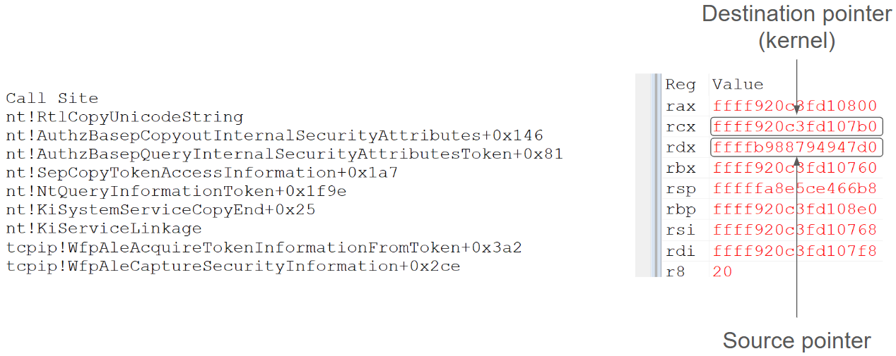
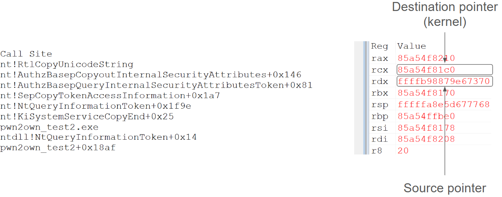
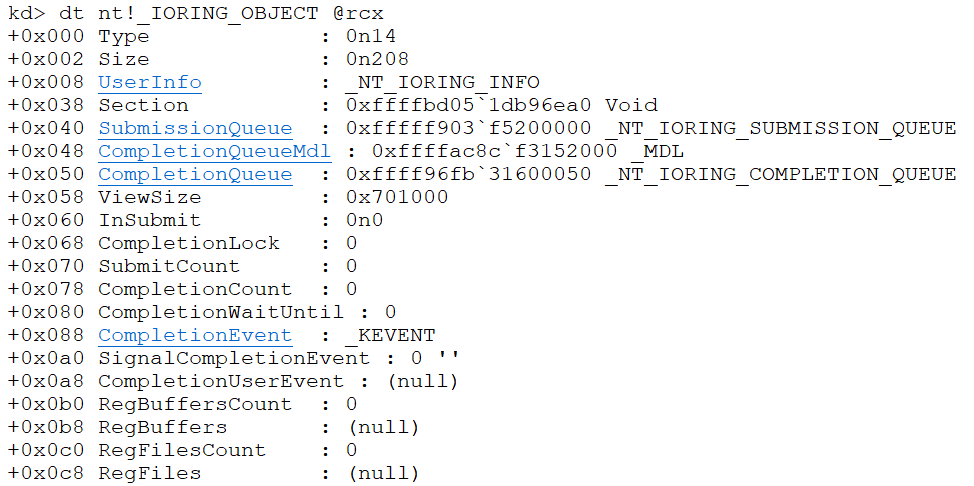
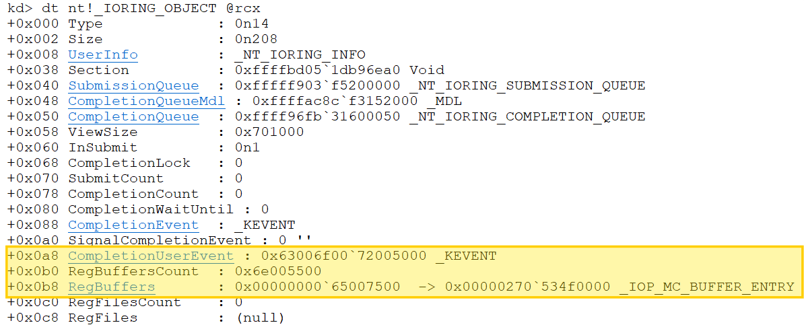
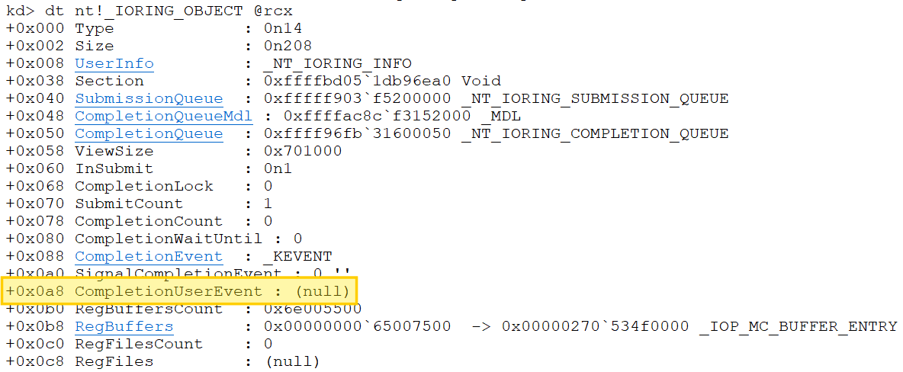

+++
title = "CVE-2024-30088 Pwning Windows Kernel @ Pwn2Own Vancouver 2024 (Plus Xbox)"
date = 2025-08-14
[extra]
author = "carrot_c4k3"
logo = "zd.svg"
+++

## Intro

In 2024 I participated in Pwn2Own Vancouver and ended up scoring a full win in the Windows Local EoP category. Participating in Pwn2Own has been a long time goal for me and it was a really wonderful experience\! In this post I’ll go through my process of finding and exploiting the vulnerability that I used in the contest.

## A Primer on Probing

I would like to start off this post with a quick note that is important to keep in mind when thinking about the bugs and exploitation techniques in this post. One thing that always seems to surprise people who do kernel vulnerability research against other operating systems such as Linux or macOS to learn is that Windows does not enable [SMAP](https://en.wikipedia.org/wiki/Supervisor_Mode_Access_Prevention). On operating systems that do enable SMAP buffers residing in user mode memory must be deliberately copied into and out of kernel memory by using specific APIs such as copyin and copyout in the case of Linux, any other attempt to directly dereference a pointer to user mode memory will result in an exception. Windows kernel code on the other hand can dereference user mode memory at any point with no problem.

Instead of having single APIs like copyin and copyout to capture user mode memory and copy it to kernel mode, every pointer that comes from user mode is supposed to be checked using ProbeForRead and ProbeForWrite. These functions do not copy the memory into kernel mode, they simply check that the pointer passed in resides in the user mode range, to keep user mode processes from specifying kernel pointers. After the pointer has been “probed” it is treated like any other pointer, and it is up to the developer if they choose to copy the contents into kernel mode or simply continue operating on the user mode address. When developers opt for the latter option, they open themselves up to a lot of risk: many kernel functions are not meant to operate on user mode memory and may be unsafe to handle untrusted user input. This appears to be exactly the case for the vulnerabilities discussed in this post: user mode pointers being passed to functions that should only accept kernel mode pointers.

## Research Process

I would love to be able to provide a perfectly clear description of my research process when looking for vulnerabilities, but in reality it is a very scattershot process of opening a lot of IDA Windows and closing them based off of a sort of gut-feel. The process I followed in this was roughly the same as that outlined by Fabien Perigaud of Synacktiv in his [2021 presentation on targeting Windows 10 for Pwn2Own](https://www.synacktiv.com/sites/default/files/2021-10/2021_sthack_windows_lpe.pdf): enumerate default kernel drivers and start reversing.

One driver stuck out to me as it was relatively new: bfs.sys. This “Brokering File System” driver appeared starting in 23H2 to provide [file system isolation to applications](https://blogs.windows.com/windowsdeveloper/2023/06/14/public-preview-improve-win32-app-security-via-app-isolation/). I began reverse engineering the IOCTL handlers and came across a race condition vulnerability. 

## The First (Not Applicable) Vuln

When returning data to user mode in the function `BfsProcessQueryPolicyRequest`, the driver constructs a `UNICODE_STRING` struct in user mode memory. After setting up the length and pointer fields of the `UNICODE_STRING` struct, the driver then calls [RtlCopyUnicodeString](https://learn.microsoft.com/en-us/windows-hardware/drivers/ddi/wdm/nf-wdm-rtlcopyunicodestring) with the destination parameter pointing to this struct in user mode memory.

The `RtlCopyUnicodeString` function is only designed to process `UNICODE_STRING` structures residing in kernel mode, and use of it on buffers residing in user mode memory is unsafe, as the function does not probe any of the Buffer pointers in the `UNICODE_STRING` structures passed to it. This means that a `UNICODE_STRING` structure residing in user mode memory may contain a Buffer pointer to kernel mode memory. Because of this, it is possible for user mode to make a string be copied to an arbitrary kernel mode address.

This vulnerability is somewhat similar to the double-fetches I described in a [previous blog post](https://exploits.forsale/24h2-nt-exploit/), but with one difference: in a typical double-fetch a value is read twice. Here a value is written and then read back, so while the exploitation is similar the pattern is slightly different.

Having found a vulnerability I was confident I could reliably exploit, I started preparing an exploit targeting the version of Windows that would be used at Pwn2Own: 23H2. At this point I encountered an issue: the vulnerable function was not present in 23H2. I typically perform my research on Windows Insider Canary builds to ensure that all bugs I discover are eligible for the Windows Insider bug bounty. As a result, I sometimes end up discovering vulnerabilities that have not shipped publicly to users yet. This was, unfortunately for me, one of those scenarios.

I was disheartened by the discovery that my vulnerability would not help my chances at Pwn2Own, but I was still pleased with the bug that I had found. I was specifically curious to see if there were any other spots in Windows where the same mistake regarding use of `RtlCopyUnicodeString` on user mode memory existed, so I began to hunt for variants in 23H2.

## Variant Hunting

My one persistent area of research in Windows is the NT kernel (ntoskrnl.exe). I’ve previously written about some [vulnerabilities I found in NT](https://exploits.forsale/24h2-nt-exploit/), and it is generally an attractive attack surface as NT syscalls are accessible to any process regardless of sandboxing. Because of this, I picked NT as my first candidate for variant hunting.

My initial pool of variants came from simply looking for calls to `RtlCopyUnicodeString` inside NT. This yielded around 80 results, lots to dig through. The scenario I was looking for was a call to `RtlCopyUnicodeString` in a syscall, with the destination string passed into `RtlCopyUnicodeString` pointing to user mode memory.

Function names in NT are helpfully prefixed with an acronym corresponding to their component (ex: Ps for process related function, Fs for file system related functions, etc.). Much of the code inside NT is not directly accessible via syscall entry points, so I focused first on looking at instances of calls to `RtlCopyUnicodeString` inside components that I knew exposed a large amount of code via syscalls.

# The Second Vuln

After going through a few of the candidates I came across one instance, in `AuthzBasepCopyoutInternalSecurityAttributes`, which appeared to be directly on a syscall path. I placed a breakpoint on the function in a kernel debugger and used the VM in hopes of triggering the code. After a bit I managed to get a hit, but it was only being called from within the kernel by tcpip.sys, so the destination string was still in kernel mode.  
  
*The call to RtlCopyUnicodeString when called from a kernel driver.*

Having found this instance of the code being triggered I was able to mimic the way that tcpip.sys called the syscall and create a user mode program that would call it in a similar way. Once I had created a program to call the syscall in the same way I once again placed a breakpoint on the call to `RtlCopyUnicodeString` inside `AuthzBasepCopyoutInternalSecurityAttributes` and ran my program. I saw that the destination string was indeed pointing to user mode memory, meaning this instance is indeed vulnerable in the same way that bfs.sys was. I was very excited to have found a bug that looked promising, but it was time for more reversing to understand what exactly this code was that contained the bug.

  
*The call to RtlCopyUnicodeString when called from a user mode program.*

# Understanding The Area

As can be seen on the stack, the syscall that is being called here is `NtQueryInformationToken`. `NtQueryInformationToken`, like other `NtQueryInformation*` syscalls, contains a gigantic switch statement for handling different information classes that can be passed in to query information about kernel objects from user mode. In my previous post I discussed discovering and exploiting a vulnerability in `NtQueryInformationThread`. Because of the numbers of different information classes handled these syscalls contain enormous complexity, all hidden behind a single syscall entrypoint.

This bug is in the handling of the `TokenAccessInformation` information class. Microsoft documentation states the following regarding this information class:

```
The buffer receives a TOKEN_ACCESS_INFORMATION structure that specifies security information contained in the token.  
```

The definition of the `TOKEN_ACCESS_INFORMATION` in the public Windows headers is as follows:

```c  
typedef struct _TOKEN_ACCESS_INFORMATION {  
  PSID_AND_ATTRIBUTES_HASH     SidHash;  
  PSID_AND_ATTRIBUTES_HASH     RestrictedSidHash;  
  PTOKEN_PRIVILEGES            Privileges;  
  LUID                         AuthenticationId;  
  TOKEN_TYPE                   TokenType;  
  SECURITY_IMPERSONATION_LEVEL ImpersonationLevel;  
  TOKEN_MANDATORY_POLICY       MandatoryPolicy;  
  DWORD                        Flags;  
  DWORD                        AppContainerNumber;  
  PSID                         PackageSid;  
  PSID_AND_ATTRIBUTES_HASH     CapabilitiesHash;  
  PSID                         TrustLevelSid;  
  PSECURITY_ATTRIBUTES_OPAQUE  SecurityAttributes;  
} TOKEN_ACCESS_INFORMATION, *PTOKEN_ACCESS_INFORMATION;  
```  
The specific field that is being handled in `AuthzBasepCopyoutInternalSecurityAttributes` is the very last one, `SecurityAttributes`, which is of type `PSECURITY_ATTRIBUTES_OPAQUE`. By looking at the definition of this type in the public Windows headers we can see that it is simply typedef’d to a void pointer, meaning it is likely a private structure that Microsoft has chosen not to document.

```c  
typedef PVOID PSECURITY_ATTRIBUTES_OPAQUE;  
```

This doesn't really matter though if we want to quickly get an exploit together, what matters is we have found a juicy bug that allows us to write to kernel, and now we can get to exploiting it!

# The Primitive

With this vulnerability we are able to write a 32-byte unicode string anywhere in kernel memory. We do not control the contents of the string, but we know what they are (in this case `"TSA://ProcUnique"`), so we can look for places where writing that string could allow us to build a read/write primitive.

If we’re able to find a pointer field of an object which is set to NULL, and use our write primitive to write to 28 bytes before the pointer starts, we could corrupt the lower 4 bytes of the pointer while leaving the upper 4 bytes set to zero. This would result in the pointer containing a value which would be a valid user mode address. We could then map that address in our process and craft an object there which the kernel would act upon. 

When considering objects to target with this primitive I remembered [chompie and FuzzySec’s blog post](https://www.ibm.com/think/x-force/patch-tuesday-exploit-wednesday-pwning-windows-ancillary-function-driver-winsock) about exploiting a bug in afd.sys, where they targeted an IO ring object, so I decided to give that a try.

# IO Ring Object Corruption

Corrupting the `RegBuffers` field of the `IORING_OBJECT` can allow for arbitrary kernel read/write, if the value it is corrupted with is a valid user mode address that we can map in our process. For more about this I recommend reading [Yarden Shafir’s blog post](https://windows-internals.com/one-i-o-ring-to-rule-them-all-a-full-read-write-exploit-primitive-on-windows-11/) where she first outlined the technique, but the massively oversimplified tl;dr is that if you can corrupt the `RegBuffers` field of an IO ring object and make it point to a user mode address, you can achieve arbitrary kernel read/write.

Immediately after creating a fresh IO ring object, we can look and see what all its fields are initialized to:  


Our goal here is to make `RegBuffers` point to a user mode address. Unfortunately, since our write primitive is 32-bytes, we cannot simply corrupt the `RegBuffers` field, but must corrupt the fields around it as well, including the `CompletionUserEvent` field, which is a pointer. After using out write to corrupt the IO ring object we can see the fields that have been modified:  


This is great because `RegBuffers` now points to a user mode address, however because `CompletionUserEvent` has been corrupted we have a new problem. Any use of the IO Ring object now will dereference this corrupted pointer, leading to a crash near the end of the syscall. Luckily, since this happens at the end, this means the write has already occurred, meaning we can perform one arbitrary write before crashing. We can use that arbitrary write to overwrite `CompletionUserEvent` and set it back to null, leaving the IO ring object in this final state:  
  
At this point we have an IO ring object with RegBuffers pointing to a valid user mode address, and no other problematic corruption, meaning we’re able to read and write whatever kernel memory we want\!

# Read/Write Achieved\!

With the read/write achieved the escalation is pretty simple, just do [some classic token swapping](https://hshrzd.wordpress.com/2017/06/22/starting-with-windows-kernel-exploitation-part-3-stealing-the-access-token/), and boom\! We have successfully elevated our process. This is pretty much the end of the development process.

# The Contest

All that was left after this process was to wait eagerly for the date of the contest and hope that the vulnerability didn’t get fixed beforehand. Luckily the bug survived to the conference, the exploit worked successfully, and it was not a duplicate. Because it was not the first entry targeting Windows kernel it received a 50% prize payout of $15,000.

Overall the event was a lot of fun. It was great to meet so many other talented hackers who were participating, and the suspense of demonstrating the exploit live definitely adds to the experience. I am really grateful that I got to participate and would definitely recommend it\!

# Epilogue: Collateral Damage on Xbox

## Background

I set out to find and exploit this bug solely with the goal of playing at Pwn2Own, and I had intended for the bug’s life to end there, but in May of 2024 the Xbox One Research team published a post about dumping decrypted Xbox games through a technique they named [Durango dumplings](https://xboxoneresearch.github.io/games/2024/05/15/xbox-dump-games.html). Console hacking, specifically the Xbox 360, was what got me interested in the world of security in the first place, so naturally I was excited to see progress being made on hacking modern Xbox consoles.

The Xbox One Research team mentioned that they had achieved code execution in retail mode on Xbox and then exploited a kernel vulnerability to elevated privileges, but did not share their work that achieved those parts. I realized that the vulnerability I had used for Pwn2Own, since it was in NT, was likely present on Xbox and accessible from the sandboxes which most Xbox apps run in. Given that I decided to see if I could repurpose my Pwn2Own exploit to target the Xbox.

## Step 1: Code Exec on Xbox

The Xbox does not allow for arbitrary executables to simply run at Medium Integrity Level, like when you double-click a program on Windows, but it does allow developers to create and publish apps on the Xbox Store. These apps run in a UWP (or AppContainer) sandbox, which runs with a token that has Low Integrity Level, and is unable to access many devices and files. In order to exploit the kernel, we would first need to gain user mode code execution by exploiting one of these applications. With that in mind, I began to hunt around on the Xbox Store for applications that looked like good targets to gain initial code execution.

I began by searching for scripting engines and anything that might contain an interpreter for code, and stumbled upon an application called Game Script. Game Script allows users to write programs in [a language called Ape](https://github.com/kgabis/ape).

Given that I had never heard of Ape before, I began to poke around at the available APIs. I quickly found functions named `pointerSetUnsignedInteger8Bit` and `pointerGetUnsignedInteger8Bit` which, as the names suggest, allow reading and writing a single byte of memory. As simple as that, read/write in user mode was possible and the next question was turning that into code execution.

The next API I discovered was `slBus_destroy`, which takes in a pointer to an object with a VTable and dereferences a pointer from it to perform a call. Combined with the read/write capability that I already had, this was sufficient to craft a function from within Ape that would allow calling arbitrary native functions.

After unlocking the ability to call arbitrary native functions, the next step to get to truly executing native code is simply calling `VirtualAlloc` and `VirtualProtect`, and then boom, we are able to map and run (sandboxed) native code\!

## Step 2: Porting The Exploit

Now that we have native code running the next step is to get our exploit running. The first step to this was to be able to load an actual executable, and not simply have to map and run shellcode. This task was generously taken on by my friend Lander Brandt, who wrote a [great blog post about the process](https://landaire.net/reflective-pe-loader-for-xbox/)\!

After attempting to run basically the same exploit technique however, we quickly hit a wall: the exploit written for Pwn2Own assumed it would be run as Medium Integrity Level. This is important because the exploit relied on being able to obtain the address of kernel objects to target for corruption via calling `NtQuerySystemInformation`. This unfortunately does not work on Xbox however, because the process in which we have gained code execution is running as Low Integrity Level.

In code paths where NT returns kernel pointers to user mode, there is a call to a function called `ExIsRestrictedCaller`, to make sure that the caller is not coming from a sandboxed process. It does this by checking if the caller is able to pass a security check based on a security descriptor named `SeMediumDaclSd`, which only allows access to callers with Medium Integrity Level or higher. With this in mind, it became time to look for another way to locate the kernel objects we needed to corrupt.

## Step 3: Prefetching The Kernel Base

While not having a kernel leak was annoying, I was not especially worried about if the exploit would still be feasible as I had been in a similar situation before. I described [in a blog post last year](https://exploits.forsale/24h2-nt-exploit/) how I used a well known timing side channel with the prefetch instruction to locate the base address of the kernel on Windows 24H2 preview. All that I had to do now was collect timings from the Xbox and tweak until it became reliable. This was a fairly tedious process, especially for someone like myself who is not an expert in these things, but after a bit of work I was able to fairly reliably determine the kernel base via the prefetch side channel.

## Step 4: Unlocking NtQuerySystemInformation

Unfortunately leaking the kernel base address is not a perfect substitute for knowing the precise object addresses provided by `NtQuerySystemInformation`, but what if it could be? It turns out it can be\! As mentioned previously, the check stopping `NtQuerySystemInformation` from giving us kernel object pointers is the function `ExIsRestrictedCaller`. This function uses a global in NT called `SeMediumDaclSd`, which is a pointer to a security descriptor

Because `SeMediumDaclSd` is a global, we can calculate where it is by simply adding its offset to the kernel base which we leaked. Additionally, because it is a pointer, if we can corrupt it then we can make it point to a different security descriptor, such as one which we craft in user mode which will allow callers with Low Integrity Level.

This turns out to do the trick, and once `SeMediumDaclSd` has been corrupted we are able to once again call `NtQuerySystemInformation` exactly the same as we previously had, making the remainder of the exploit work basically the same as previously\!

## Step 5: Profit\!

At this point we’ve done it, we have exploited the kernel of the SystemOS virtual machine on Xbox\! We are able to spawn a reverse shell, read and write arbitrary kernel memory, and just generally mess around. Because of the Xbox security model this is nowhere near a full “jailbreak”, but it has provided researchers with the ability to have a foothold on the console, and I’m hopeful that we will see more progress escalating to other parts of the system in the future.

# thanks to the following ppl\!\!

squiffy  
landaire  
chompie  
all the Xbox One Research team  

all of the other pwn2own organizers and participants
